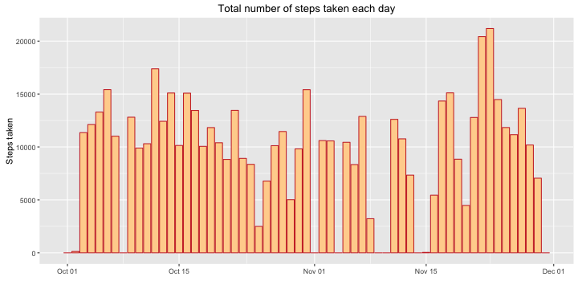

PA1_template - Rebecca Porphirio - March 8, 2016
Loading and preprocessing the data
-


```r
#loading due libraries
library(dplyr)
library(ggplot2)
library(lubridate)

#loading raw dataset
activity <- read.csv("activity.csv",header=TRUE,sep=",",stringsAsFactors=FALSE)
#transforming character variable into date class
activity$date <- as.Date(as.character(activity$date),"%Y-%m-%d")

head(activity)
```

```
##   steps       date interval
## 1    NA 2012-10-01        0
## 2    NA 2012-10-01        5
## 3    NA 2012-10-01       10
## 4    NA 2012-10-01       15
## 5    NA 2012-10-01       20
## 6    NA 2012-10-01       25
```

What is the mean and the total number of steps taken per day?
-


```r
#Calculating total number of steps taken per day
days <- 
  activity %>%
  group_by(date) %>%
  summarize(steps=sum(steps,na.rm=TRUE),
            steps_mean=sum(steps,na.rm=TRUE)/n())
sum(days$steps,na.rm=TRUE)
```

```
## [1] 570608
```

```r
#Ploting total number of steps taken each day
options(scipen=999)    #removing scientific notations
ggplot(days, aes(date, steps)) + 
  geom_bar(stat="identity", fill="burlywood1",color="brown3") +
  xlab("") + 
  ylab("Steps taken") +
  ggtitle("Total number of steps taken each day")
```

 

```r
#Calculating mean and median of the total number of steps taken per day
sum(days$steps,na.rm=TRUE)/nrow(days)
```

```
## [1] 9354.23
```

```r
median(days$steps)
```

```
## [1] 10395
```


What is the average daily activity pattern?
-


```r
#Plotting a time series of the 5-minute interval and the average number of steps taken, averaged across all
#days 
ggplot(days, aes(date, steps_mean)) + geom_line(color="cadetblue3") +
  xlab("") + ylab("Steps taken") +
  ggtitle("Average number of steps taken each day")
```

 

```r
#Creating a separate dataset
intervals <- 
  activity %>%
  group_by(interval) %>%
  summarize(steps=sum(steps,na.rm=TRUE),
            steps_mean=mean(steps,na.rm=TRUE)/n())

#Which 5-minute interval, on average across all the days in the dataset, contains the maximum number of steps?
intervals[which.max(intervals$steps_mean),"interval"]
```

```
## Source: local data frame [1 x 1]
## 
##   interval
##      (int)
## 1      835
```

Imputing missing values
-


```r
#What is the total number of missing values in the dataset?
length(which(is.na(activity$steps)))
```

```
## [1] 2304
```

```r
length(which(is.na(activity$steps)))/nrow(activity)
```

```
## [1] 0.1311475
```

```r
#Creating new dataset equal to the original dataset but with the missing data filled in
steps_fixed <-
  activity %>%
  group_by(interval) %>%
  summarize(steps_mean=sum(steps,na.rm=TRUE)/n())
activity_fixed <-
  activity %>%
  mutate(steps_fixed=ifelse(is.na(steps),steps_fixed$steps_mean,steps))

#Creating histogram of the total number of steps taken each day
days_fixed <- 
  activity_fixed %>%
  group_by(date) %>%
  summarize(steps=sum(steps_fixed,na.rm=TRUE),
            steps_mean=sum(steps_fixed,na.rm=TRUE)/n())
p2 <- ggplot(days_fixed, aes(date, steps)) + 
  geom_bar(stat="identity", fill="lightcoral",color="lightpink") +
  xlab("") + 
  ylab("Steps taken") +
  ggtitle("Total number of steps taken each day- NAs fixed")
multiplot(p1,p2) #using the multiplot function to build two graphics at the same time. 
```

 

```r
#Calculating mean and median total number of steps taken per day in new dataset
sum(days_fixed$steps,na.rm=TRUE)/nrow(days)
```

```
## [1] 10581.01
```

```r
median(days_fixed$steps)
```

```
## [1] 10395
```

```r
#Impact of imputing missing data on the estimates of the total daily number of steps
#Mean increased 13% but median hasn't moved.
#It changes most on the beginning of November where there's most of the NAs.
```

Are there differences in activity patterns between weekdays and weekends?
-


```r
#Creating a dataset with two levels – “weekday” and “weekend” indicating whether a given date is a weekday 
#or weekend day
weekdays_weekends <-
  activity %>%
  mutate(day_type=ifelse(weekdays(activity$date)=="Saturday" | 
                           weekdays(activity$date)=="Sunday","Weekend","Weekday")) %>%
  group_by(day_type,interval) %>%
  summarize(steps=sum(steps,na.rm=TRUE),
            steps_mean=sum(steps,na.rm=TRUE)/n())

#Creating a panel plot containing a time series plot  of the 5-minute interval and the average number of 
#steps taken, averaged across all weekday days or weekend days
ggplot(weekdays_weekends, aes(factor(interval), steps, fill = factor(day_type))) + 
  geom_bar(stat="identity") +
  facet_grid(.~day_type) +
  scale_fill_hue(name="Day Type",labels=c("Weekday","Weekend")) +
  scale_x_discrete(breaks=NULL) + 
  xlab("5-minute intervals") + 
  ylab("Steps taken") +
  ggtitle("Average number of steps taken per 5-minute interval across weekdays and weekends")
```

 
